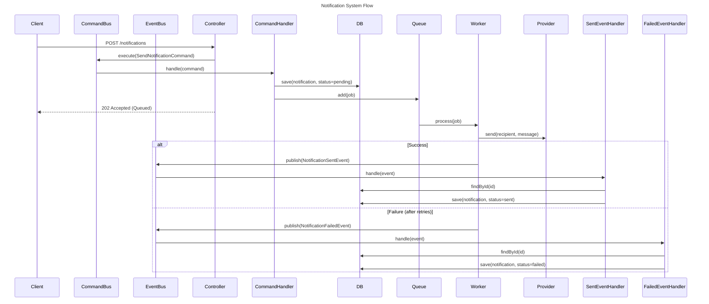

# AuraNotify: High-Performance Notification Engine

AuraNotify is a robust, enterprise-grade notification service built with **Nest.js** and **TypeScript**. It is engineered with a strict focus on **Domain-Driven Design (DDD)**, **SOLID principles**, and **Event-Driven Architecture** to ensure maximum scalability and maintainability.

---

## Architectural Excellence

This project transcends standard "CRUD" applications by implementing a multi-layered architecture that decouples business logic from infrastructure.

### 1. Layered Architecture (DDD)

- **Domain Layer (`src/notifications/domain`)**: The "Heart" of the system. Contains pure business logic, entities (`Notification`), and abstract interfaces (`INotificationRepository`). It has **zero** dependencies on external frameworks or databases.
- **Application Layer (`src/notifications/applications`)**: Orchestrates use cases via **CQRS (Command Query Responsibility Segregation)**. Commands like `SendNotificationCommand` and Events like `NotificationSentEvent`,`NotificationFailedEvent` are handled here, ensuring high-level policy is separated from implementation details.
- **Infrastructure Layer (`src/notifications/infrastructure`)**: Technical implementations. This is where TypeORM, BullMQ, and FCM (Firebase Cloud Messaging) reside. They are "plugs" that satisfy the domain's needs.
- **Interface Layer (`src/notifications/interfaces`)**: The API surface area, containing Controllers and DTOs with strict validation via `class-validator`.

### 2. Notification Flow (Sequence Diagram)

The following diagram illustrates the asynchronous, event-driven lifecycle of a notification, from the initial API request to the final database update and background delivery.



### 3. Event-Driven & Resilient

- **Async Processing**: Leverages **BullMQ** (Redis-backed) for reliable job queuing.
- **Retry Mechanism**: Implements exponential backoff for failed notification attempts.

---

## Technical Stack & Patterns

- **Framework**: [NestJS](https://nestjs.com/) (The Progressive Node.js Framework).
- **Persistence**: [TypeORM](https://typeorm.io/) with PostgreSQL (easily switchable to SQLite for In-memory for testing).
- **Task Queue**: [BullMQ](https://github.com/taskforce-sh/bullmq) for high-throughput background processing.
- **Message Bus**: [@nestjs/cqrs](https://docs.nestjs.com/recipes/cqrs) for internal event decoupling.
- **Testing**: [Jest](https://jestjs.io/) with a focus on **TDD**:
  - **Unit Tests**: Isolating domain logic and command handlers.
  - **Integration Tests**: Validating repository-to-database mapping using an in-memory SQLite provider.

---

## Key Engineering Principles Applied

- **Dependency Inversion (DIP)**: Controllers and Handlers depend on _interfaces_, not concrete implementations. This allows switching from Firebase to AWS SNS (for example) without touching a single line of business logic.
- **Single Level of Abstraction (SLAP)**: Methods are kept concise and readable, delegating low-level details to specialized services.
- **Encapsulation**: Entities use private state and domain methods (e.g., `markAsSent(), markAsFailed()`) to control state transitions, rather than exposing raw public properties.
- **Global Error Handling**: A centralized `AllExceptionFilter` ensures consistent, sanitized API responses across the entire system.

---

## Getting Started

### Prerequisites

- [Node.js](https://nodejs.org/) (v18+)
- [pnpm](https://pnpm.io/) (Preferred package manager)
- [Redis](https://redis.io/) (Required for BullMQ)

### Installation

```bash
pnpm install
```

### Configuration

Before running the application, copy the `.env.example` file to `.env` and fill in your credentials:

```bash
cp .env.example .env
```

**Required Environment Variables:**

- `PORT`: Server port (default: 3000)
- `DB_HOST`, `DB_PORT`, `DB_USERNAME`, `DB_PASSWORD`, `DB_NAME`: PostgreSQL connection details.
- `REDIS_HOST`, `REDIS_PORT`: Redis connection details for BullMQ.
- `FIREBASE_SERVICE_ACCOUNT_JSON`: The full JSON string of your Firebase service account for FCM.

### Running the App

```bash
# Development
pnpm run start:dev

# Production mode
pnpm run start:prod
```

### Running Tests

```bash
pnpm test
```

---

## API Specification

### Send Notification

**POST** `/notifications`

```json
{
  "recipientToken": "device-token-123",
  "message": "Hello from AuraNotify!"
}
```

**Response**: `202 Accepted` (Indicates the notification has been successfully queued for background delivery).

---

## Engineering Philosophy

This codebase is a demonstration of how to build software that is **easy to change, hard to break, and built to scale**. Every line of code is written with the intention of being self-documenting, type-safe, and rigorously tested.
